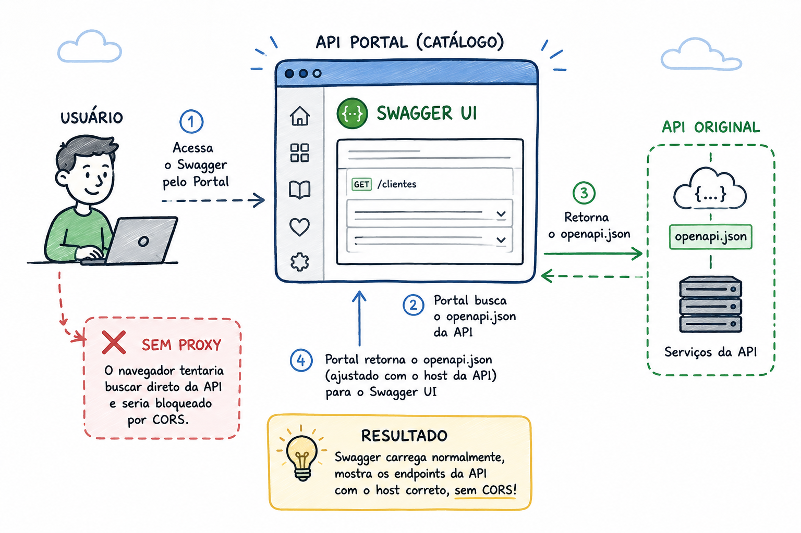
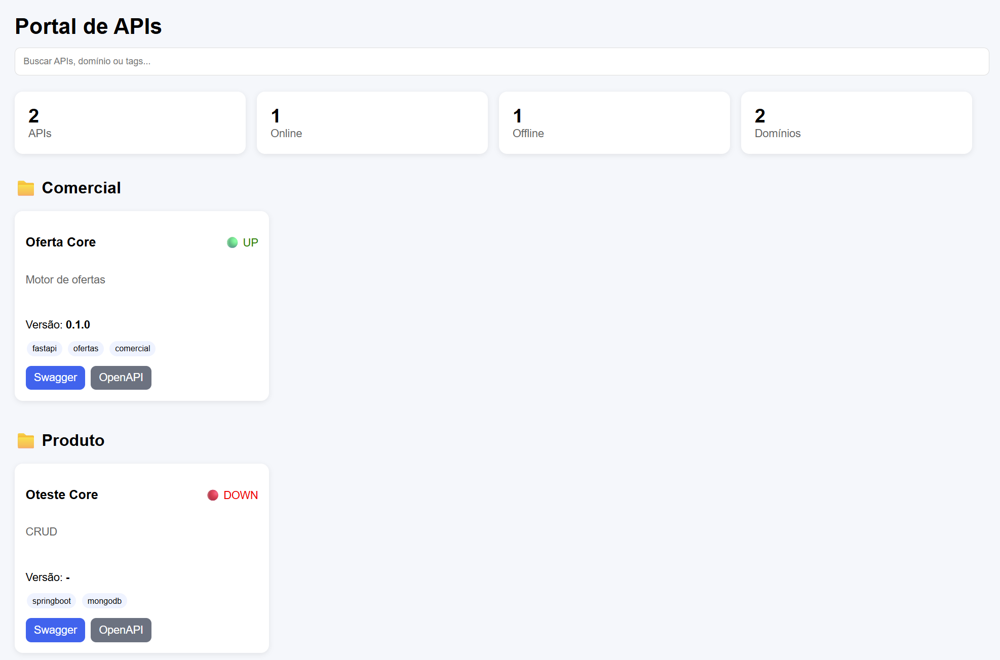

# Centralizing API Documentation with FastAPI and Swagger UI

**The chronic problem of scattered APIs — and how I solved it with ~200 lines of Python**

---



---

## The problem every developer has faced

If you work at a company with more than five teams, you've been through this:

> *"What's the Swagger URL for the offers API again?"*
> *"Let me check... I think it's on Jenkins... or was it Confluence? Wait, the link is broken."*

APIs exist, they're documented (when they are), but nobody knows where to find them. Each service's Swagger lives on a different URL, on different ports, in different environments. By the time you finally find the right URL, the service is down and you had no idea.

This is a chronic problem in microservice-heavy environments. The documentation exists, but access to it is decentralized, inconsistent, and prone to silent failures.

---

## The idea

The simplest possible solution: a central portal that:

1. Reads a list of APIs from a configuration file
2. Checks in real time whether each API is up
3. Reads the current version directly from each API's `openapi.json`
4. Opens the Swagger documentation for any API with a single click

No database. No complex authentication. No additional infrastructure. A single YAML file with registered APIs and a FastAPI application to bring the catalog to life.



---

## Project structure

```
app/
├── main.py
├── model/api.py
├── repositories/catalog_repository.py
├── routers/
│   ├── home.py          # dashboard
│   ├── api_catalog.py   # REST endpoint
│   └── swagger.py       # viewer + proxy
└── services/
    ├── catalog_service.py
    ├── health_service.py
    └── openapi_service.py

config/
└── apis.yaml            # the single place to register APIs
```

Simple and straightforward. Each layer has a single responsibility.

---

## The heart of the project: the configuration file

Everything starts in `config/apis.yaml`. To register a new API in the catalog, just add an entry:

```yaml
apis:
  - id: offers-core
    nome: Offers Core
    dominio: Commercial
    descricao: Offers engine

    tags:
      - fastapi
      - commercial

    openapi: http://localhost:8000/openapi.json
    healthcheck: http://localhost:8000/health
```

Two fields are special: `openapi` and `healthcheck`. These are what the system uses to fetch each API's state in real time.

The `CatalogRepository` loads this file with PyYAML:

```python
class CatalogRepository:
    def __init__(self):
        self._file = Path("config/apis.yaml")

    def load(self):
        with open(self._file) as f:
            return yaml.safe_load(f)
```

---

## Enriching data in parallel

The most interesting part is the `CatalogService`. For each registered API, it needs to make two HTTP calls: one to the healthcheck and one to the `openapi.json`. If done sequentially, with 10 APIs, that means waiting through 10 timeouts in case of failure.

The solution is to use `asyncio.gather` to fire all calls in parallel:

```python
async def list(self):
    config = self.repo.load()
    apis = config["apis"]

    tasks = [self._enrich(api) for api in apis]
    return await asyncio.gather(*tasks)

async def _enrich(self, api):
    status = await self.health.status(api["healthcheck"])
    version = await self.openapi.version(api["openapi"])

    return {
        **api,
        "status": status,
        "version": version
    }
```

With `asyncio.gather`, all APIs are checked simultaneously. The total time is determined by the slowest API, not the sum of all of them.

---

## Health check and version: simple and resilient

The `HealthService` makes a GET request with a short timeout (2 seconds) and returns `"UP"` or `"DOWN"`. Any exception — timeout, refused connection, DNS failure — silently becomes `"DOWN"`:

```python
class HealthService:
    async def status(self, url: str) -> str:
        try:
            async with httpx.AsyncClient() as client:
                response = await client.get(url, timeout=2)
                return "UP" if response.status_code == 200 else "DOWN"
        except Exception:
            return "DOWN"
```

The `OpenApiService` does the same for the version: fetches the `openapi.json`, extracts `info.version`, and returns `None` on failure. Nothing crashes — the catalog keeps working even if half the APIs are down.

```python
class OpenApiService:
    async def version(self, url: str) -> str | None:
        try:
            async with httpx.AsyncClient() as client:
                response = await client.get(url, timeout=5)
                response.raise_for_status()
                return response.json().get("info", {}).get("version")
        except Exception:
            return None
```

---

## The dashboard: grouped by domain

The `home.py` router builds the context for the Jinja2 template. APIs are grouped by business domain — Commercial, Product, Finance — which makes navigation much easier as the catalog grows:

```python
@router.get("/")
async def home(request: Request):
    apis = await service.list()
    grouped = {}

    for api in apis:
        grouped.setdefault(api["dominio"], []).append(api)

    total = len(apis)
    online = sum(1 for api in apis if api["status"] == "UP")

    return templates.TemplateResponse(
        request=request,
        name="index.html",
        context={
            "apis": apis,
            "grouped": grouped,
            "total": total,
            "online": online,
            "offline": total - online,
            "domains": len(grouped),
        }
    )
```

The dashboard shows a summary at the top (total APIs, how many are online, offline, how many domains) and the grouped cards below.

---

## The Swagger viewer and the CORS problem

Clicking a card opens the Swagger UI loading the selected API's `openapi.json`. But here a classic problem arises: the browser blocks cross-origin requests from Swagger UI to APIs that don't have CORS headers configured.

The solution is a simple proxy in the backend itself:

```python
@router.get("/proxy/openapi")
async def proxy_openapi(url: str):
    try:
        async with httpx.AsyncClient() as client:
            response = await client.get(url, timeout=10)
            response.raise_for_status()
            return JSONResponse(content=response.json())
    except Exception as ex:
        raise HTTPException(status_code=500, detail=str(ex))
```

The Swagger UI points to `/proxy/openapi?url=<openapi_url>`. The backend fetches the spec, and the browser makes a same-origin request — no CORS issues.

---

## How to run it

The project uses `uv` for dependency management. With it installed:

```bash
uv run uvicorn app.main:app --host 0.0.0.0 --port 8080 --reload
```

Go to `http://localhost:8080` and the catalog is live. To register a new API, edit `config/apis.yaml` and reload the page.

---

## Key takeaways

**1. YAML as a source of truth is enough to get started.** You don't need a database for a read problem. A file versioned in the repository is auditable, easy to edit, and works with any CI/CD pipeline.

**2. Silent resilience in external integrations.** Health checks and OpenAPI calls fail frequently. The system cannot break because of that — treating any exception as a degraded state (`"DOWN"`, `None`) is the right approach here.

**3. `asyncio.gather` is the right tool for parallel I/O.** The latency difference between sequential and parallel calls becomes immediately noticeable once you have more than 5 APIs.

**4. A proxy solves CORS without touching the APIs.** Rather than requiring every team to configure CORS correctly, the catalog takes that responsibility centrally.

---

## Next steps

The project has room to evolve without losing its simplicity:

- **TTL cache** — the infrastructure already exists in `app/cache/memory_cache.py`; applying it in `CatalogService` reduces load on the monitored APIs
- **Environment support** — add `dev`, `staging`, `prod` per API in the YAML
- **Simple authentication** — a `Depends` in FastAPI with a static token handles unauthorized access
- **Unified OpenAPI export** — aggregate all specs into a single document

---

## Conclusion

Decentralized documentation is a discoverability problem. The information exists, but the cost of finding it is too high to be paid routinely.

A central catalog, even a simple one, changes that cost. From "I need to ask someone" to "I open the portal and see it". With ~200 lines of Python and a YAML file, it's possible to solve this for an entire team.

The code is available at: **[\[repository link\]](https://github.com/tiagoBarbano/benchmarks/tree/main/04)**

---

*Enjoyed it? Leave a clap and share it with that colleague who still sends Swagger URLs over Slack.* 🙂
